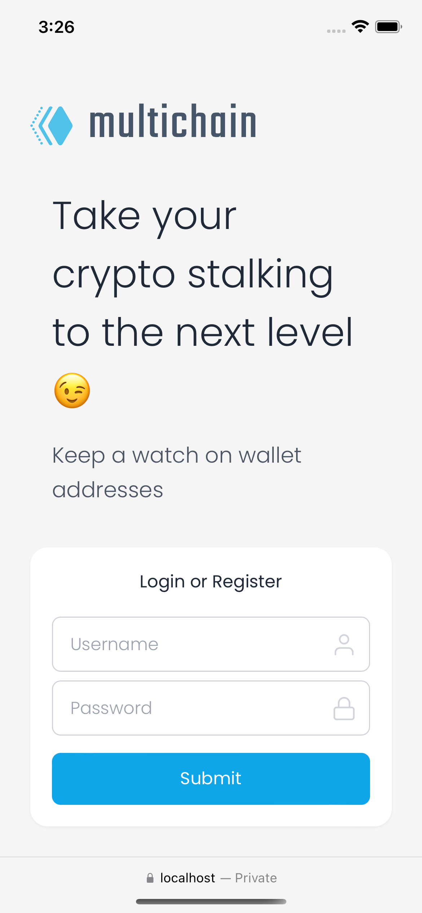
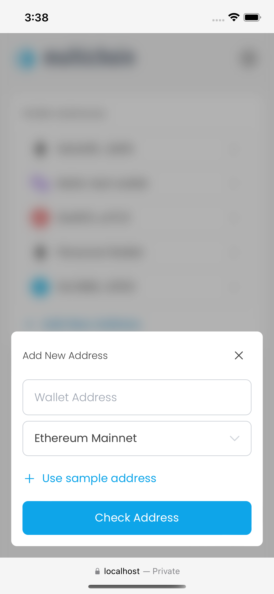
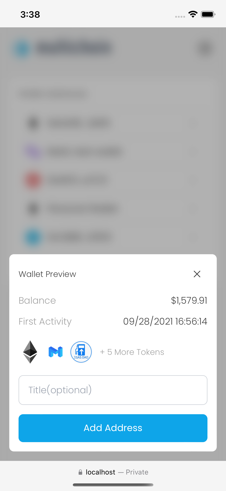
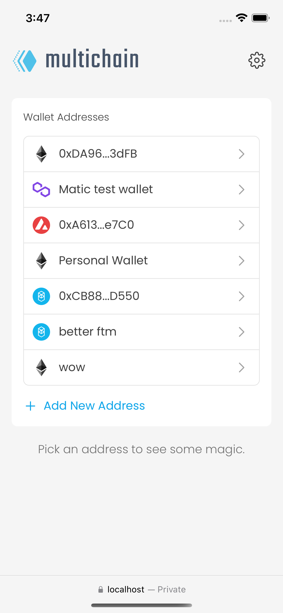
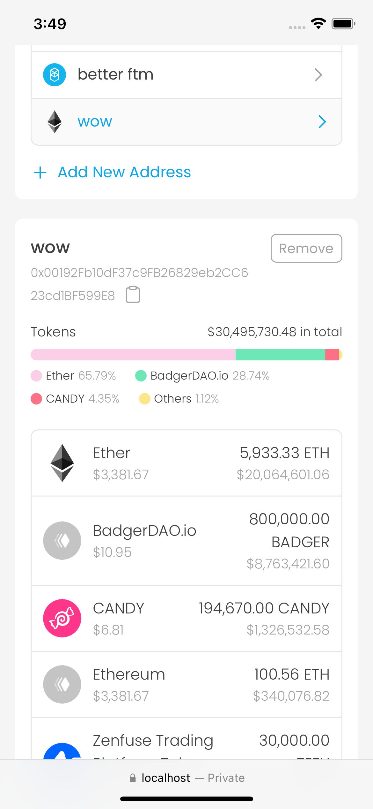
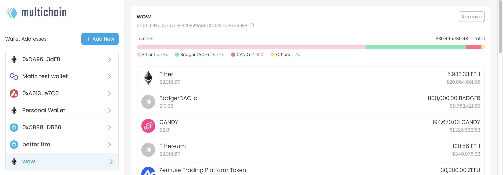

# multichain
##### A dashboard to track wallet addresses across multiple blockchains.
View online demo at [https://multichain.liara.run](https://multichain.liara.run)

> This project was developed for [Multi-Chain Web3 Projects](https://gitcoin.co/issue/covalenthq/covalent-gitcoin-bounties/19/100028550) bounty at the [Grants Round 13 Hackathon](https://gitcoin.co/hackathon/gr13/?) sponsored by [Covalent](https://www.covalenthq.com).

### Mobile screenshots

  
  
  
  
  

### Desktop screenshot

    

### Covalent API Details
1. `` Get token balances for address `` -  to get address balance
2. `` Get all chains `` -  to get chains list
3. `` Get historical prices by ticker symbol `` -  to get price of tokens
4. `` Get transactions for address `` -  to get address first activity

### UI
[multichain UI design on Figma](https://www.figma.com/file/0Yof96GS60ghkhUqAlU9iH/multichain?node-id=0%3A1)

---

### License
Distributed under the MIT License. See [LICENSE](/LICENSE) for more information.
